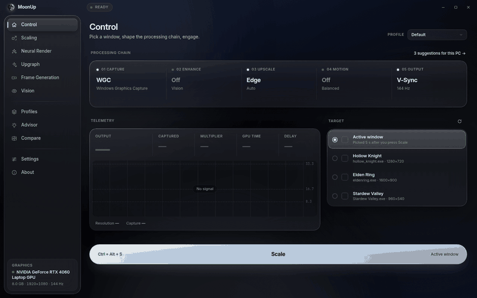
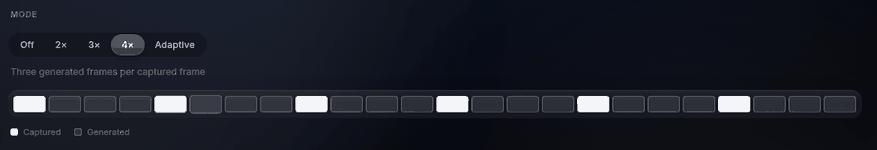
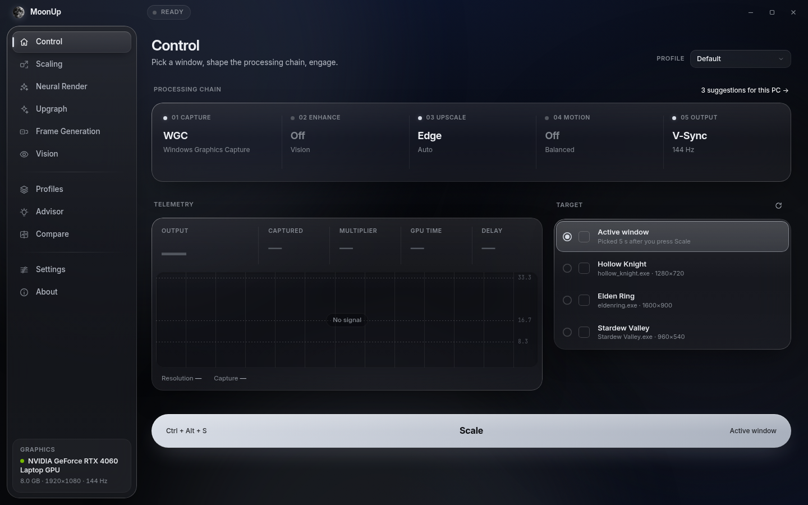
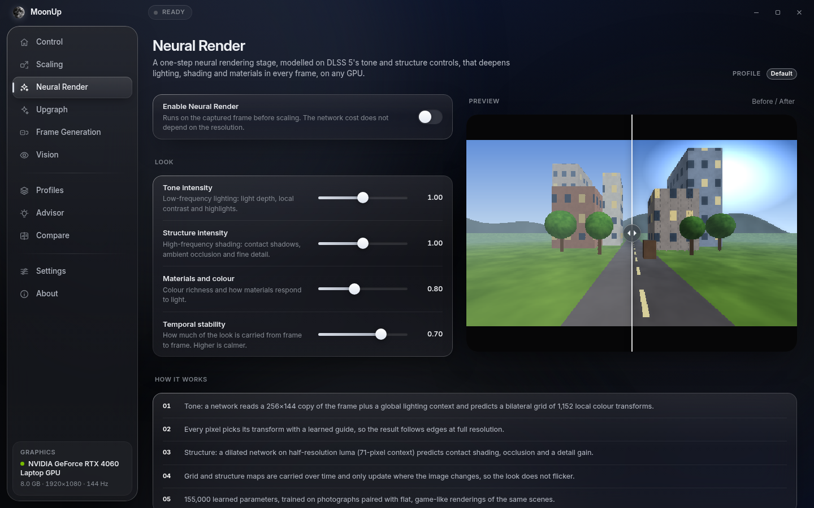
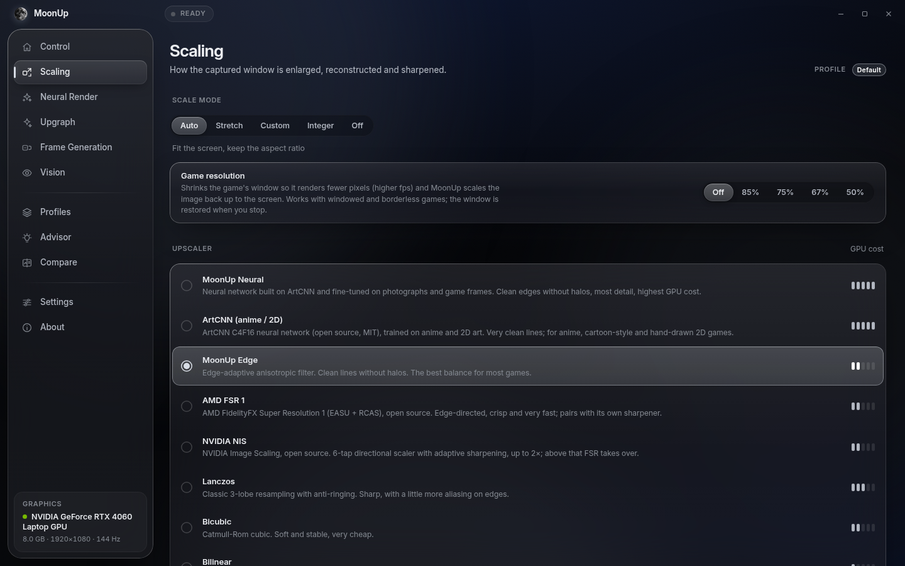
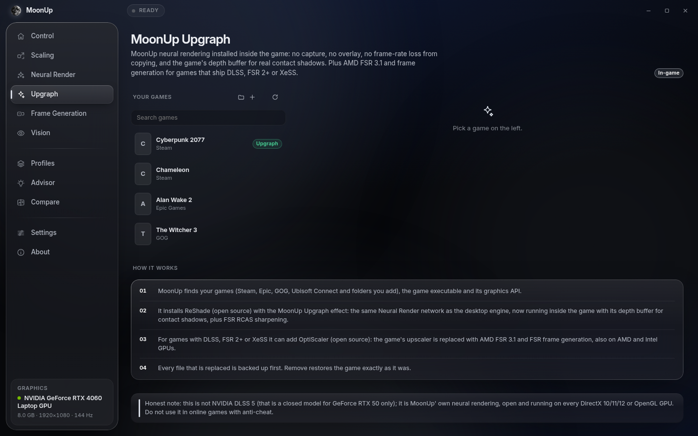

<p align="center">
  
</p>

<p align="center">
  <a href="https://github.com/twayst0/MoonUp/releases/latest"></a>
  
  
  <a href="LICENSE"></a>
</p>

<p align="center">
  <b>Upscale any game window, generate in-between frames and add a neural "next-gen" look —<br>
  without touching the game, on any DirectX 11 GPU.</b><br>
  <a href="docs/README.tr.md">Türkçe</a>
</p>

<p align="center">
  
</p>

---

## ✦ What it does

| | |
|---|---|
| 🌕 **Upscaling** | MoonUp Neural v3 (a CNN fine-tuned from ArtCNN), ArtCNN for anime/2D, AMD FSR 1, NVIDIA NIS, MoonUp Edge, Lanczos, integer / pixel-art. Run the game at a lower resolution, MoonUp scales it to your screen — or let **Game resolution** shrink the game window for you. |
| 🌗 **Frame generation** | MoonUp Motion: dense per-pixel optical flow with HUD lock and scene-cut detection. **2× / 3× / 4× / Adaptive** (up to 6×, targets your refresh rate). |
| 🌑 **Neural Render** | A one-step neural look stage modelled on DLSS 5's tone and structure controls: lighting depth, materials and colour, contact shading, temporal stability. |
| 🛰️ **Upgraph** | Installs the Neural Render effect *inside* games through ReShade (with the game's depth buffer), and AMD FSR 3.1 + frame generation through OptiScaler for games that ship DLSS / FSR 2+ / XeSS. Every change is journaled and can be removed exactly. |
| 📈 **FPS counter** | Always-on, click-through counter for the window in front — also when MoonUp is not scaling. Counts only real new frames. |
| 🛡️ **Performance guard** | Frame rate first: lighter effects before ever limiting the frame rate, automatic passthrough when there is nothing to do, collapse protection for games that slow down when covered. |

<p align="center">
  
</p>

## ✦ Screenshots

<table>
  <tr>
    <td></td>
    <td></td>
  </tr>
  <tr>
    <td></td>
    <td></td>
  </tr>
</table>

## ✦ Quick start

1. Download **`MoonUp-win64.zip`** from [Releases](https://github.com/twayst0/MoonUp/releases/latest) and unzip it anywhere (keep `MoonUp.exe`, `WebView2Loader.dll` and the `ui` folder together).
2. Start `MoonUp.exe`. Pick your language; settings are tuned to your hardware.
3. Run your game **windowed** or **borderless** (exclusive fullscreen cannot be captured).
4. Choose a target and press **Scale** — or press **Ctrl + Alt + S** in game. Press it again to stop.

> **Tip:** upscaling only raises fps when the game renders fewer pixels. Set **Scaling → Game resolution** to 75 % or 67 %, or lower the resolution in the game's own settings.
> Frame generation pays off when the game runs *below* your refresh rate — cap it at e.g. half your refresh rate for the smoothest result.

Requirements: Windows 10 1903+ or Windows 11, a DirectX 11 GPU, Microsoft Edge WebView2 Runtime (built into Windows 11).

## ✦ How it works

```
game window ─► capture (Windows Graphics Capture / Desktop Duplication)
            ─► Neural Render ─► Vision ─► upscaler ─► sharpen          (D3D11 compute)
            ─► MoonUp Motion: optical flow + interpolated frames
            ─► click-through overlay (flip model, waitable swap chain) + HUD
```

- The engine runs in its own process: a driver fault never takes the app down.
- Repeated frames that Windows delivers again are ignored (dirty regions), so fps numbers and frame generation follow the game's real frames.
- Logs are written to `logs\` next to `MoonUp.exe`.

## ✦ Build from source

Cross-compiled on Linux with mingw-w64:

```bash
apt install g++-mingw-w64-x86-64-posix
tools/build.sh            # -> build/MoonUp.exe
tools/build_shaders.sh    # only when HLSL changed (precompiled DXBC is embedded)
```

Training scripts for the networks live in `tools/` (`train_neural_ft.py`, `train_render.py`), the test bench in `tools/bench/`.

## ✦ Good to know

- **Anti-cheat:** Upgraph injects ReShade / OptiScaler into the game. Do **not** use it in online games with anti-cheat — you risk a ban. The capture-based scaler does not touch the game.
- **DLSS 5 (Upgraph, NVIDIA RTX only, experimental):** uses community projects and NVIDIA runtime files downloaded from their own sources at your request. It is unofficial and may break with game or driver updates.
- MoonUp is an independent project and is not affiliated with NVIDIA, AMD, Intel or Microsoft.

## ✦ License

MoonUp is **source-available** under the [PolyForm Noncommercial License 1.0.0](LICENSE).

- ✅ Free to download, use on your own computer, study and modify for **personal, non-commercial** purposes.
- ❌ **No commercial use** — you may not sell it, bundle it into paid products or use it to make money.

Third-party components keep their own licenses — see [THIRD_PARTY_NOTICES.md](THIRD_PARTY_NOTICES.md).

<p align="center"><sub>Made by <a href="https://github.com/twayst0">twayst0</a> · 🌕</sub></p>
